# 코르소나 (Coursona)

**콜슨이 만든 페르소나** — iPhone·iPad·Mac 에서 내 촬영본으로 만드는 3D 흉상 페르소나. Vision Pro 의 페르소나처럼 내 표정·고개·목소리를 따라 움직이지만, 온디바이스로만 동작하고 세 플랫폼 전부에서 쓸 수 있다.

> 상태(2026-10-08 밤): **구현 중 — C0·C1·C2·C4 완료, C3·C5·C6·C8 진행 중, 다음 단계는 실기기 재검증**. `CoursonaKit` 패키지가 실제로 빌드되고 테스트가 돈다(Swift Testing **140개 전부 통과**). 캡처(A/B/C 등급)→피팅→텍스처→패키지 저장→검수 화면까지 **처음부터 끝까지 한 바퀴 실제로 돈다** — Mac(B 등급)과 **실제 iPhone 16(TrueDepth A 등급)** 둘 다에서 코르소나를 만들어 봤고, iPhone 에서 만든 `.coursona` 를 AirDrop 으로 Mac 에 가져와 검수했다. 블렌더 5.2 헤드리스로 만든 Persona 재현 에셋(머리카락·칼라 셔츠·눈알·입안)이 붙고, 유령 룩(반투명·가장자리 소멸·하단 페이드) 셰이더로 그린다. 입체감용 가우시안 스플랫은 **폐기**했다(iOS 에 API 가 없고 세 겹이 따로 보이는 문제 — 지금은 머리부터 어깨까지 한 메시·한 텍스처). 실기기 A 등급 캡처로 드러난 네 가지(어깨 틈·시선·겹침 배지·헤어라인)는 시뮬레이터에서 고쳤고(아래 "실기기 캡처 검수"), **실기기 재설치 후 확인이 다음 할 일**이다 — 체크리스트를 아래에 적어 뒀다. 거울(라이브 구동 화면)·기기 간 전송·접근성(UI 4~6단계)은 아직이다. 상세 현황은 `Docs/Tasks.md`.

## 한 줄 요약

블렌더에서 만든 흉상 메시가 기하의 진실이다. 사용자는 **등급 3가지** 중 하나로 그 흉상을 "내 얼굴"로 만든다.

| 등급 | 입력 | 기기 | 정밀도 |
|---|---|---|---|
| **A** | Face ID 카메라(TrueDepth) | iPhone·iPad(Face ID 모델) | 얼굴 형태·깊이 직접 측정 |
| **B** | 일반 전면 카메라 | Mac 전부, Face ID 없는 iPhone·iPad | 얼굴 치수는 추정, 나중에 A 로 업그레이드 가능 |
| **C** | 사진 1장 | 전부 | 정면만 측정, 옆모습은 추정, 가장 빠름 |

> **TrueDepth 는 라이다(LiDAR)가 아니다.** Face ID 카메라(TrueDepth)는 적외선 점 패턴을 얼굴에 투사하고 그 왜곡을 적외선 카메라로 읽는 방식(구조광)이다 — 아이폰 뒷면 카메라의 라이다(빛의 왕복 시간을 재는 ToF 센서, Pro 기종에만 있음)와는 센서도 원리도 다르다. 그래서 **라이다가 없는 iPhone 16(Pro 아님)도 앞면에 TrueDepth 가 있어서 A 등급**이 된다 — A 등급 판정은 `FaceCaptureSession.isSupported`(`ARFaceTrackingConfiguration.isSupported` + TrueDepth 하드웨어 여부)만 본다(`TierClassifier.swift`), 라이다는 어디서도 확인하거나 쓰지 않는다.

초상(Chosang) 프로젝트에서 검증한 "블렌더 흉상 + ARKit 패치 치환" 피팅은 그대로 가져오되, **눈알·입안을 따로 띄워 생기던 돌출·어긋남을 없앤다** — 분리된 물체 대신 같은 메시 안에서 눈·입 구멍을 닫고(캡), 그 위에 블렌더에서 만든 실제 눈알·입안 메시를 피팅된 자리에 붙인다. 얼굴부터 어깨까지 **한 메시·한 장의 사진 텍스처**로 그리고, 머리카락과 칼라 셔츠는 Persona 재현 에셋으로 덧입혀 Apple Persona 느낌의 반투명 흉상으로 완성한다(처음 설계의 "얼굴면만 또렷, 나머지는 스플랫 입체감"은 2026-10-07 에 이 방식으로 바꿨다).

## 지금까지 구현된 것 (C0·C1·C2)

문서가 아니라 실제로 빌드·테스트되는 코드 기준이다.

- **`CoursonaKit` 로컬 패키지** — 초상(Chosang)의 `ChosangKit` 을 복사해 12개 모듈로 포팅(Core·Capture·ML·Fit·Face·Texture·Splat·Rig·Drive·IO·Validate·Studio). 식별자·파일 확장자·UTI 를 전부 Coursona 로 바꿨다. `CoursonaFace`·`CoursonaSplat`·`CoursonaML`·`CoursonaDrive`·`CoursonaStudio` 는 이 프로젝트에만 있는 신규 모듈이다.
- **등급 자동 판정** — `TierClassifier`: Face ID 카메라가 있고 5초 안에 깊이가 들어오면 A, 아니면 B(2026-10-06 실기기 확인 — TrueDepth 깊이 프레임이 평균 ≈0.86초 간격으로 드물게 와서 옛 2초는 짧았다, 아래 "실기기(2026-10-06)" 참고). 아무 기기도 막지 않는다.
- **얼굴면 분리 + 눈·입 구멍 닫기** — `FaceSurfacePartitioner`(얼굴면 삼각형만 앞쪽으로 재배열) + `CapBuilder`(경계 변 위상 탐색으로 눈·입의 실제 열린 테두리를 찾아 중간 고리+중심으로 닫는다). 블렌더 내부 상수를 추측하지 않는, 처음 설계보다 더 안전한 방식으로 교체했다 — `Docs/TechPRD.md` §6.2 구현 노트.
- **피팅된 좌표로 다시 닫기 + 표정과 같이 움직이기** — `BustEntity` 가 피팅 결과(Identity)를 템플릿에 대입한 뒤 **같은** `CapBuilder` 를 다시 불러 캡을 피팅된 모양으로 닫는다. 캡의 새 정점에는 그 캡이 붙은 테두리의 평균 델타를 줘서, 눈을 감거나 입을 벌려도 캡이 같이 움직이고 뜯어지지 않는다. 설계가 단순해져 "캡 위치를 따로 저장" 할 필요가 없어졌다 — `Docs/TechPRD.md` §6.4 구현 노트.
- **겹침(자기교차) 검사** — `SelfIntersectionCheck`: 52개 표정 중 델타가 있는 것 각각에서 캡 삼각형이 뒤집히는지(= 겹침 의심) 확인한다.
- **실루엣 피팅에서 눈·입 제외** — 깊이로 두상을 당기는 단계가 눈·입 안쪽은 건드리지 않고, 그 구멍 근처 깊이점(눈알·치아 자리)도 무시한다.
- **`BustEntity` 렌더링(입체감 v3)** — 얼굴면·눈 캡 2·입 캡·나머지(두피·목·어깨)를 `LowLevelMesh.Part` 로 나누되, 나머지도 얼굴과 **같은 사진 텍스처 머티리얼**로 그린다(머리부터 어깨까지 한 메시). 눈·입 에셋이 붙으면 캡만 투명해진다. 유령 룩은 피부용 표면 셰이더(`coursonaPersonaBust`)가 담당한다.
- **템플릿 반입** — 초상의 기본 템플릿에 블렌더 헤드리스로 만든 Persona 에셋(`Template.usdz`·`library/`·`textures/`·`coursona_assets.json`)을 더해 `Default.coursonatemplate`(44MB)로 재구성(`tools/make_default_template.sh`).
- **선택 2컷(눈 감기·입 벌림) 게이팅 + 셰이프 직접 치환(F7)** — `ShotKind` 에 `eyesClosed`·`mouthOpen` 을 추가해 A 등급(`FaceCaptureSession`, ARKit 블렌드셰이프 가중치)·B 등급(`PhotoCaptureSession`, Vision 눈/입 랜드마크 비율) 둘 다 이 두 컷을 찍을 수 있다. 찍히면 `UserShapeDeltas` 가 그 컷에서 `eyeBlinkLeft/Right`·`jawOpen` 셰이프 델타를 **직접** 읽어 치환한다 — 기존의 미소 컷 기반 진폭 스케일 보정(F10)보다 정확하다(합성 테스트로 확인: 사용자 셰이프가 템플릿 델타의 단순 배율이 아닐 때 스케일 보정은 4배 더 부정확하다). 안 찍으면 조용히 F10 으로 빠진다.
- **C 등급(사진 1장) 적합성 검사** — `PhotoSuitability`: 정면(yaw/pitch)·눈 뜸·입 다묾·밝기·얼굴 크기를 B 등급과 같은 임계값으로 판정, 순수 로직이라 Vision 없이도 단위 테스트가 된다.
- **단안 피팅(B·C 등급)은 이미 동작한다** — C0 에서 포팅한 `SparseFitter`를 `FaceFitter.fit` 이 사진 전용(희소) 번들에 자동으로 연결해 준다. Vision 8점(눈꼬리·코끝·입꼬리·턱) 대응 + 여러 컷의 랜드마크 광선을 삼각측량해 실제 깊이를 복원하고(ML 깊이 모델 없이도 코 깊이 오차 0.37mm), 3D RBF 로 두상 전체에 전파한다. **코드도 테스트도 이미 있었는데 로드맵 문서에 반영이 안 돼 있었다** — 이번에 확인하고 C4 를 완료로 올렸다. 자세한 경위는 `Docs/TechPRD.md` §6.4 "구현 노트(C4)".
- **저장 전 깊이 검증(T-301)** — `DepthCoverage`: A 등급 필수 5컷 중 깊이가 빠진 컷을 찾아 어떤 컷을 다시 찍어야 하는지 한글로 안내한다. TrueDepth 깊이는 색 프레임과 주기가 달라 "찍었는데 깊이가 없는" 컷이 생길 수 있어서 따로 확인이 필요했다. `coursona-validate --fit` 에도 연결해 실제 번들을 열 때 바로 보인다.
- **B 등급 캡처 품질·인물 매트 게이트(T-302)** — `DetectFaceCaptureQualityRequest`(조명·선명도·중앙 위치 점수 ≥ 0.5)와 `GeneratePersonSegmentationRequest`(얼굴 상자를 5×5 그리드로 샘플링해 "실제로 사람인가" 비율)로 게이팅. 전체 매트 이미지(배경 제거용 알파 채널) 저장은 **못 한다** — 그 접근자가 이 프로젝트 배포 타깃(OS 26)보다 높은 OS 27+ 를 요구하는 걸 직접 컴파일해서 확인했다. 점 단위 샘플링(`pixel(at:)`)은 OS 26 에서 된다는 것도 같은 방식으로 확인하고 그 선까지만 썼다 — `PersonCoverage.swift`, Vision 타입과 분리된 순수 로직이라 단위 테스트 가능.
- **iPad 가로 거치 기록(T-306)** — `CaptureOrientation`(7종)을 `CaptureShotMeta.orientation` 에 기록. `UIDevice.current.orientation` 을 그대로 적을 뿐, **영상·깊이·좌표 회전 수학은 조금도 바꾸지 않았다** — 초상(Chosang)의 회전 버그가 바로 그 수학을 실기기 검증 없이 건드려서 난 문제였기 때문에 가장 조심한 부분이다. `beginGeneratingDeviceOrientationNotifications()` 를 안 부르면 이 값이 항상 "모름"이라는 게 Apple 문서에 명시돼 있다 — 실기기 없이는 몰랐을 함정이라 세션 시작·종료에 추가했다.
- **캡 전용 UV 섬(C5, T-501 선행)** — `CapBuilder`가 `cap_eye_L`/`cap_eye_R`/`cap_mouth` UV 영역이 있으면 그 안에 전용 원형 UV 섬을 만든다. 기존 `lid_L`/`lid_R`/`lip`은 눈꺼풀·입술 **피부** 영역이라 용도가 달라 재사용하지 않고 새 키로 분리했다 — 재사용했으면 캡이 주변 피부 텍셀을 그대로 베끼는, 지금과 같은 문제가 또 생겼을 것이다. 키가 없으면(지금의 모든 템플릿) 옛 동작(바깥 고리 UV 상속)으로 조용히 되돌아간다.
- **눈·입 캡 내용물 투영(T-502)** — 전용 코드 없이 됐다. `TextureBuilder`가 텍스처를 만들기 전에 `BustEntity`와 같은 방식으로 눈·입 구멍을 먼저 닫아서, 캡 삼각형도 다른 모든 영역과 **같은** 다중 컷 카메라 투영 파이프라인을 그대로 받는다 — 캡이 실제 눈·입이 열린 3D 자리에 있으니 "눈 뜸" 컷을 보면 눈 내용물이, "입 벌림" 컷을 보면 입 내용물이 자연히 투영된다. `CoursonaTexture`가 `CoursonaFace`에 새로 의존(순환 없음). 구멍 없는 지금의 합성 템플릿으로는 캡이 전부 생기지 않아 기존 테스트가 전부 그대로 통과(회귀 없음) — 다만 이는 "구멍이 실제로 있을 때 제대로 투영되는지"는 아직 전용 테스트가 없다는 뜻이기도 하다(실제 블렌더 템플릿이 생기면 눈으로 확인).
- **`faceOnly` 옵션(T-501 완료)** — 얼굴 패치·눈꺼풀/입술 안쪽·캡만 전체 해상도로 투영하고, 나머지(두피·목·어깨)는 그 단계에서 샘플링 자체를 건너뛴다 — 관측 없음으로 남아 **기존** 채움 로직(두피 평균·목 피부색 등)이 그대로 메운다, 새 코드 없이. 나머지 색은 `splatColor`(기본 512², 접합·페더 없이 평균만 — 스플랫은 이산적이라 이음매가 안 보임)로 따로 낸다. Metal 백엔드는 이 로직을 몰라 패리티가 깨지므로 `faceOnly` 켜지면 CPU로 강제한다 — 솔직하게 느리더라도 정확한 쪽을 택했다.
- **(폐기됨 — 입체감 v3, 2026-10-07)** 아래 스플랫 세 항목은 만들었다가 지웠다. 실기기에서 "흉상 메시(고스트)+스플랫 점구름+눈알/입안" 세 겹이 따로 보였고, iOS 에는 `GaussianSplatComponent` 자체가 없어서다. 지금은 머리부터 어깨까지 한 메시에 한 장의 텍스처를 입히고, 머리카락·셔츠는 Persona 에셋으로 덧입힌다. 코드는 git 이력(`CoursonaSplat/`)에만 남아 있다. 기록용으로 그대로 둔다.
- **스플랫 바인딩(T-503, 폐기)** — `SplatBinder`: `TextureBuilder`와 **같은 "얼굴면 밖" 정의**로 비얼굴 삼각형마다 면적 비례 1~3개 스플랫을 바인딩(위치·외접원 기준 스케일·접평면 회전), 목·어깨 1.3배, 두피 2겹(머리카락 두께 느낌), 얼굴면과 맞닿은 바깥 2겹은 완전 불투명으로 이음매를 가린다. 색은 `faceOnly`가 만든 `splatColor`에서 샘플링하고 없으면 기본 피부색. `splats.bin`(`SplatFile`, magic `CSP1`)으로 직렬화 — 렌더용 데이터와 재굽기용 바인딩(삼각형·바리센트릭·오프셋)을 분리 저장해서 나중에 변형이 생겨도 다시 구울 수 있다. **옷 평균색 등 영역별 기본색은 아직 하나(피부색)로 단순화**했다 — 옷 텍스처 소스가 없어서다. `GaussianSplatResource`가 실제로 기대하는 바이트 레이아웃도 아직 미확인(T-504에서 확인 예정).
- **RealityKit 브리지(T-504, 폐기) — 그리고 중요한 제약 발견** — `SplatGPUBridge`: Apple 공식 예제와 같은 레이아웃(인터리브 14 float, `LowLevelBuffer` + `BufferDescriptor` 5개)으로 `[SplatRecord]` → `GaussianSplatComponent`. 실제로 빌드해보고서야 알게 된 것 둘: ① `GaussianSplatComponent`/`GaussianSplatResource`는 `@available(macOS 27, *)` — 이 프로젝트 배포 타깃(OS 26)보다 높다 ② **iOS SDK 엔 이 타입이 아예 없다**("cannot find in scope", iPhone 시뮬레이터 빌드로 확인) — macOS(아마 visionOS도) 전용으로 보인다. **즉 지금 기준 iPhone·iPad에서는 네이티브 가우시안 스플랫 입체감을 아예 못 쓴다** — Mac(OS 27+, Apple7 GPU)만 된다. iOS에서는 고스트 파트 폴백이 "임시"가 아니라 사실상 기본 경로가 됐다. `isSupported()`는 두 플랫폼 공통으로(iOS는 항상 false) 가용성 체크 없이 부를 수 있게 했다. 이 Mac(M3, macOS 27.0.1)에서 실제로 `GaussianSplatComponent`를 만들어 통과까지 확인했다 — 컴파일만 되고 안 돌려본 코드가 아니다.
- **검증**: `cd CoursonaKit && swift test` → **140개 테스트, 31개 스위트 전부 통과**(스플랫 테스트가 빠져 150→140). Xcode 빌드(macOS·실제 iPhone·iPhone 시뮬레이터) 전부 성공.
- **남은 것(C3)**: Vision 76점 전체 대응(`VisionCorrespondence` — 있으면 더 좋지만 지금의 8점으로도 이미 합격선을 만족해 막힌 일은 없다), 단안 깊이 추정(`CoursonaML.MonoDepthEstimator` — B 등급엔 급하지 않고 C 등급 단일 사진 품질 개선용), 배경 제거용 전체 인물 매트(OS 27 배포 타깃으로 올릴 때 재검토). `AVDepthData.cameraCalibrationData` 저장은 **의도적으로 보류**했다 — 기존 경험적 깊이 보정(`DepthRegistration`)이 이미 잘 동작하고, calibration 데이터의 실제 필드는 TrueDepth 실기기 없이는 검증할 방법이 없어서 섣불리 손대는 게 더 위험하다고 판단했다.
- **`BustEntity` 배선(T-504b, 폐기)** — `applySplats(splatColor:fallbackSkin:options:)`: `SplatBinder.build`(캡 열기 전 원본 템플릿+Identity를 따로 보관해 캡이 이중 처리되지 않게 함) → `SplatGPUBridge.makeComponent` → 성공하면 `"BustSplats"` 자식 엔티티에 `GaussianSplatComponent`를 붙이고 고스트를 자동으로 끈다. 미지원(iOS 전부·macOS<27·Apple7 미만 GPU·레코드 없음)이면 조용히 고스트 폴백. `CoursonaRig`가 `CoursonaSplat`에 새로 의존. 패키지 테스트 대상이 아닌 `BustEntity`(RealityKit·`@MainActor` 의존, F5/F6과 같은 이유)라 이 개발 Mac(OS 27.0.1)에서 `RunCodeSnippet`로 실제 부착(`splatsActive=true`, 고스트 자동 꺼짐)까지 확인했다.
- **남은 것(C5)**: Mac 실기기 성능 측정(T-505). 실제 블렌더 UV 언랩에 `cap_eye_L` 등 자리를 비워 내보내는 건 아직 안 됐다 — 구체적인 요구사항이 정해지면 Blender+Claude Desktop MCP 작업 요청으로 정리할 예정.
- **1€ 필터(T-602 선행)** — `OneEuroFilter`(`CoursonaCore`, 순수 수학): 느린 움직임은 세게, 빠른 움직임은 약하게 스무딩해 "지연 vs 떨림" 트레이드오프를 완화하는 표준 알고리즘(Casiez et al. 2012)을 그대로 구현. 단위 테스트 4개(일정 신호 수렴·노이즈 분산 감소·beta 로 지연 감소·reset).
- **`VisionFaceDriver`(T-602)** — `VisionFaceSignals`(순수 로직) + `VisionFaceDriver`(상태 보유). B 등급 캡처가 이미 쓰는 `PhotoCaptureSession`(카메라+Vision 파이프라인)을 그대로 재사용해 중복 Vision 호출 없이 눈 종횡비(좌우)·입 폭 비·안쪽 입술 종횡비·눈썹 거리·동공 오프셋을 추가로 뽑고, 이걸 2초 중립 캘리브레이션 기준값과 비교해 jawOpen·mouthSmile L/R·mouthPucker·mouthFunnel·eyeBlink L/R·browInnerUp·browDown L/R·eyeLook 8방향 + yaw/pitch/roll 을 만든다. 채널마다 `OneEuroFilter` 하나씩. 순수 변환 로직은 합성 데이터로 단위 테스트 8개를 통과했지만, **실제 카메라로 사람 얼굴을 추적하는 것 자체는 아직 확인 못 했다** — `RunCodeSnippet`으로 켜봤는데 이 실행 환경의 카메라 권한이 `.notDetermined`라 승인 대화상자를 눌러줄 수가 없었다(이전 TierClassifier 실기기 조사와 같은 "상호작용 실행이 필요하다"는 종류의 한계). 임계값(완전히 감았을 때 눈 종횡비 비율 등)도 전부 경험적 추정이라 실기기 확인이 더 필요하다.
- **`ARKitFaceDriver`(T-601)** — A 등급 캡처(`FaceCaptureSession`)가 이미 실기기로 검증한 `ArkitWeights(named:)` 변환과 `FacePoseConvention` 자세 규약을 그대로 재사용해 ARSession 프레임마다 52 가중치 + 머리 자세를 흘린다. 표정 가중치는 신뢰도가 높지만, yaw/pitch 도(度)를 쿼터니언으로 합성하는 축·순서는 라이브 구동에서 처음 쓰는 것이라 **실기기 없이는 맞는지 모른다** — 코드 머리말에 🧪로 명시해 뒀다(회전 수학을 실기기 없이 건드리면 위험하다는 건 초상 때의 교훈).
- **`MicVisemeDriver`·`FaceDriverCoordinator`(T-603)** — 마이크 보완은 새 합성 로직이 필요 없었다: `FaceRigComponent.externalWeights`가 `nil`이면 `FaceRigSystem`(이미 포팅됨)이 음량 기반 턱·비셈 합성을 알아서 한다. `FaceDriverCoordinator`는 그 앞단에서 "지금 뭘 externalWeights에 넣을지"만 우선순위로 정한다(ARKit > Vision 추적 중 > 마이크만) — 소반의 `MouthSourceKind` 폴백과 같은 모양.
- **`FaceRigSystem` 합성 규칙(T-604) — 절반만**: 클립⊕라이브⊕비셈⊕깜빡임 합성(`ExpressionMixer`)과 `FaceRigSystem` 본체는 **새로 할 게 없었다** — 초상 `FaceRig.swift`를 복사해 포팅한 코드가 이미 완전히 같다. 다만 "시선을 눈 캡 UV 이동으로" 바꾸는 절반은 아직이다 — 지금 `BustEntity`는 얼굴면 전체(눈·입 캡 포함)가 머티리얼 인덱스 0 하나라 캡만 따로 움직일 머티리얼이 없다. 레거시 눈 엔티티 회전 코드만 남아 있다 — `BustEntity` 머티리얼을 더 쪼개는 작업이 선행돼야 해서 다음 증분으로 미뤘다.
- **시선(T-604) — 완료** — `FaceSurfacePartitioner`에 `capIndexRanges`를 추가해 캡 삼각형을 정점 그룹 판정과 무관하게 항상 얼굴면으로 치고 재배열 뒤 구간(`capRanges`)을 돌려주게 했다. `BustEntity`가 그 구간으로 눈 왼쪽·오른쪽·입 캡을 각각 전용 머티리얼(눈: roughness 0.15 + clearcoat 0.6, 입: roughness 0.7)로 떼어내고, `applyGaze(_:)`가 그 눈 캡 머티리얼의 UV 오프셋(±0.08)을 옮긴다 — 기하는 그대로라 뚫림이 없다. `FaceRigSystem`은 최종(라이브든 합성이든) eyeLook 8방향 가중치에서 바로 시선 벡터를 뽑아 넘긴다. 처음 짠 구현은 정점 그룹이 비어 있는 합성 테스트 픽스처에서 캡 삼각형 일부가 얼굴면 판정에서 빠지는 버그가 있었는데, 그걸 잡으려고 쓴 단위 테스트가 바로 잡아냈다 — `capIndexRanges`를 무조건 신뢰하도록 고쳤다. 캡 없는(구멍 없는) 템플릿은 기존 2-머티리얼 구조 그대로(회귀 없음). 이 Mac에서 `RunCodeSnippet`으로 머티리얼 3개 분리·UV 오프셋 적용까지 실제로 확인(합성 구멍 템플릿 기준 — 실제 블렌더 템플릿·실기기 확인은 남음).
- **남은 것(C6)**: 실기기(ARKit 검증 자체가 불가능, iPhone 없음)·카메라 권한이 있는 상호작용 실행(Vision 추적 확인), 지연·프레임률 실측(T-605).

### 지금 이 앱을 띄우면 보이는 것

**2026-10-06, UI 1단계 완료 후**: 자리표시자이던 `ContentView` 는 지웠고, 이제 실제 화면 1(등급 선택)·화면 9(권한)와 4탭 내비게이션(스튜디오·갤러리·정밀도·기기 연동)이 있다. 아래는 Stitch 목업이 아니라 **지금 리포 코드를 `RenderPreview` 로 Mac·iPhone·iPad 각각 실제 렌더링한 캡처**다. 이 기기(Mac)는 Face ID 카메라가 없어 올바르게 **B 등급을 추천 배지로 표시**했다 — 등급 판정이 화면에 그대로 반영되는 것까지 확인된다.

| Mac — 화면 1(스튜디오) | Mac — 화면 9(권한) |
|---|---|
| 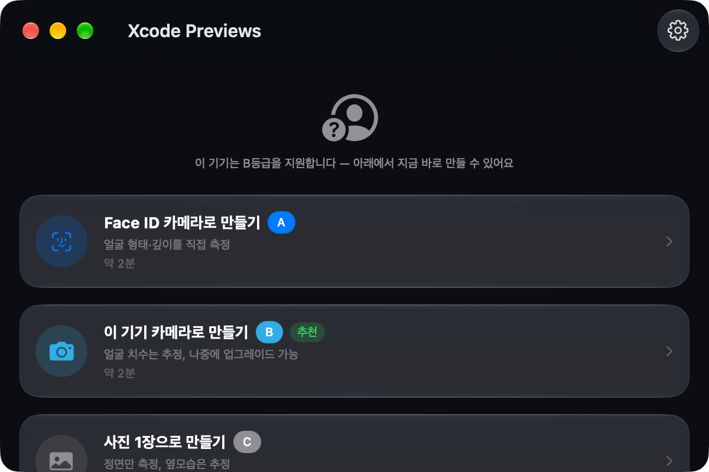 | 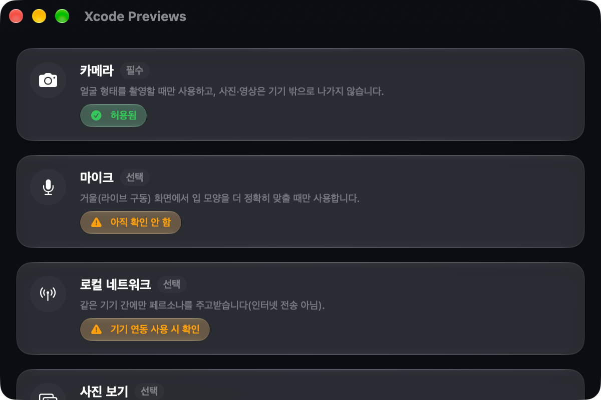 |

| iPhone — 하단 탭 4개 | iPad — 상단 탭 4개 |
|---|---|
| 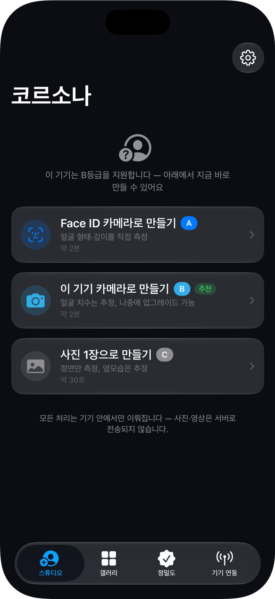 | 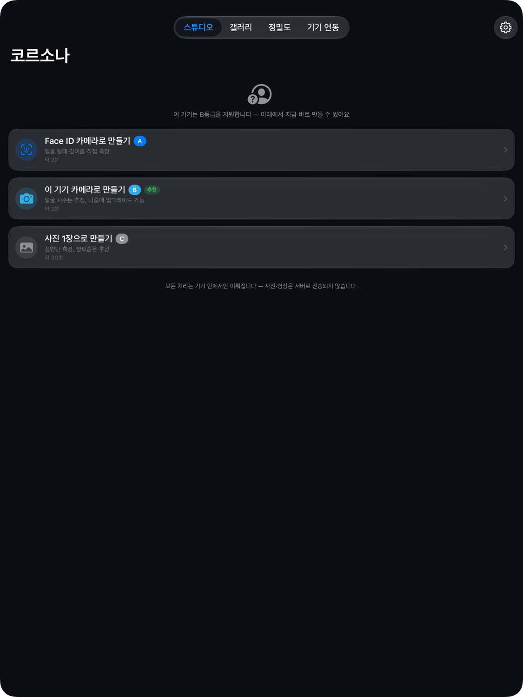 |

작은 발견 하나: 처음엔 iPhone 렌더링에서 글래스 카드·탭 바 대비가 흐릿하게 나왔다 — 시스템이 라이트 모드일 때 `.glassEffect()` 가 UXPRD 가 전제하는 다크 배경과 안 맞아서였다. `RootView` 루트에 `.preferredColorScheme(.dark)` 를 강제해서 고쳤다(UXPRD §7 이 애초에 다크를 기본 테마로 정의해 둔 것과 일치).

**2026-10-06, UI 2단계 완료 후**: 등급 카드를 누르면 이제 실제로 캡처가 시작된다 — 화면 2(`CaptureGuideView`, A/B 공용, 초상 `GuidedCaptureView.swift` 538줄 포팅)와 화면 3(`PhotoSuitabilityView`, C 등급)이 생겼고, 다 찍으면 "코르소나 만들기" 버튼이 새 `CoursonaStudio` 모듈의 `PersonaBuildPipeline` 을 실제로 끝까지 돌린다(피팅→텍스처→스플랫→패키지 저장, 합성 번들로 왕복 테스트 확인). 그동안 없던 것 — 캡처→빌드→저장을 하나로 엮는 코드 — 가 처음 생긴 순간이다.

이 단계에서 진짜 쓸모 있었던 건 **기기 상호작용 자동화로 실제로 화면을 눌러본 것**이었다: iPhone 17 시뮬레이터에 설치해서 서브에이전트가 카드를 탭하고 뒤로 가기를 반복하게 시켰더니, 두 번 연속 재현되는 진짜 크래시를 하나 찾았다 — 카메라 화면에 들어갔다 나오면 `"AVCaptureSession stopRunning may not be called between calls to beginConfiguration and commitConfiguration"` 로 죽었다. 원인은 `PhotoCaptureSession`(B 등급 캡처 백엔드, C6 라이브 드라이버도 같이 쓴다)에 두 가지: 세션 설정과 정지가 서로 다른 스레드에서 따로 돌아 겹칠 수 있었던 것, 그리고 더 결정적으로 — 시뮬레이터처럼 카메라 연결이 실패하면 옛 코드가 `commitConfiguration()` 을 안 부르고 바로 에러를 던져서 세션이 "설정 중" 상태로 영영 멈춰버리는 것. 둘 다 고치고 같은 자동화로 5연속 빠른 진입/이탈 + 실제 "시작" 탭 + 실패 배너 경로까지 다시 돌려 크래시가 없어졌음을 확인했다. 리뷰 없이 코드만 봤으면 못 찾았을 버그다.

<details>
<summary>UXPRD 화면 2·3 포팅 메모</summary>

- 초상은 iOS(ARKit)·Mac(사진 폴백)을 다른 화면으로 나눴지만, UXPRD 화면 2 는 "A/B 등급 공용 뼈대"로 정의돼 있어서 한 화면을 두 플랫폼에서 그대로 쓴다 — 햅틱(`UIImpactFeedbackGenerator` 등)만 `#if os(iOS)` 로 가리고 나머지(카메라 미리보기·점선 타원 조준점·샷 칩·글래스 하단 바)는 공유.
- 코르소나의 `ShotKind` 는 7개(선택 2컷 포함)라 초상의 5개짜리 칩·아이콘·안내문을 그만큼 늘렸다.
- 다 찍은 뒤: 초상은 "번들 저장 + zip 내보내기"로 끝났지만, 코르소나는 그 자리에서 바로 `PersonaBuildPipeline` 을 불러 끝까지(피팅·텍스처·스플랫·패키지 저장) 만든다. 지금 진행 표시는 최소 버전(단계 이름 텍스트 하나)이고, 3단계에서 UXPRD 화면 4(4단계 체크리스트)로 교체한다.
- `PhotoSuitabilityReport` 는 "적합 여부 + 실패 이유 목록"만 주지, 항목별 개별 체크가 아니다 — 화면도 그 모양 그대로 보여준다(문서에 없는 5항목 체크리스트를 꾸며내지 않았다).

</details>

**2026-10-06, UI 3단계 완료 후**: 빌드가 끝까지 화면으로 보인다 — 화면 4(`BuildProgressView`, 4단계 체크리스트), 화면 5(`InspectionView`, 실제 `RealityView` 뷰포트 + 포즈 세그먼트 + 입체감 토글 + "겹침 없음 ✓" 배지), 화면 6·6b(`SaveShareView`, 이름 바꾸기 + zip 내보내기)가 생겼다. `RunCodeSnippet`으로 이 Mac에서 합성 번들 전체를 끝까지 돌려(피팅→텍스처→스플랫 20,876개→저장) `.coursona` zip(12MB)으로 내보내고 이름을 바꿔 재저장하는 것까지 실제로 확인했다.

| 화면 4 — 빌드 진행 | 화면 6·6b — 저장·보내기 |
|---|---|
| 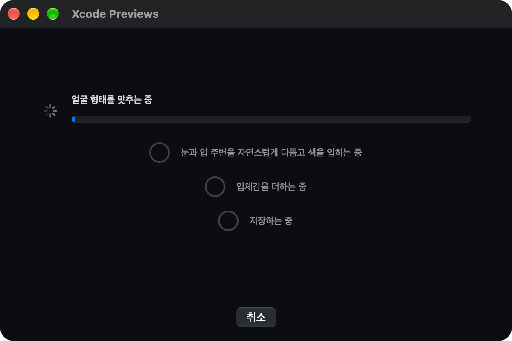 | 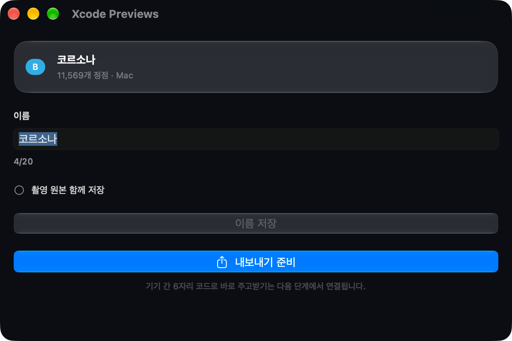 |

<details>
<summary>UXPRD 화면 4·5·6 구현 메모</summary>

- `BuildProgressView`는 UXPRD의 "4단계"를 파이프라인이 실제로 보고하는 4단계(피팅·텍스처·입체감·저장)에 그대로 대응시켰다 — "얼굴면 완성"은 별도 단계가 아니라 캡(눈·입) 닫기가 텍스처 단계 안에서 일어나므로 그 단계 문구에 자연히 들어 있다.
- `InspectionView`는 초상 `TemplatePreviewView.swift`의 `RealityView` + `@Observable` 홀더 패턴을 그대로 재사용했다. 작업 중 발견한 것: `RealityViewContent`는 visionOS 전용이고 iOS·macOS는 `RealityViewCameraContent`라는 게 따로 있다 — `some RealityViewContentProtocol`로 받아서 플랫폼 분기 없이 하나로 처리했다.
- `BustEntity`에 `applySplatRecords(_:)`(이미 구운 스플랫을 다시 바인딩하지 않고 그대로 붙임)와 `hideOutsideFace()`(스플랫·고스트 둘 다 끔)를 추가했다 — 저장된 페르소나를 다시 열 때(다음 단계 갤러리)도 그대로 쓸 수 있다.
- 자기교차("겹침") 배지는 숫자를 기본 화면에 안 보여주고 "겹침 없음 ✓" 결론만 보여준다(UXPRD §4) — 자세히 보려면 품질 카드를 펼친다.

</details>

<details>
<summary>이전 단계(C0~C3, 자리표시자였던 ContentView) 스크린샷 — 참고용, 접힘</summary>

| Mac | iPhone | iPad |
|---|---|---|
| 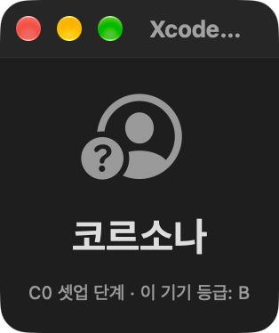 | 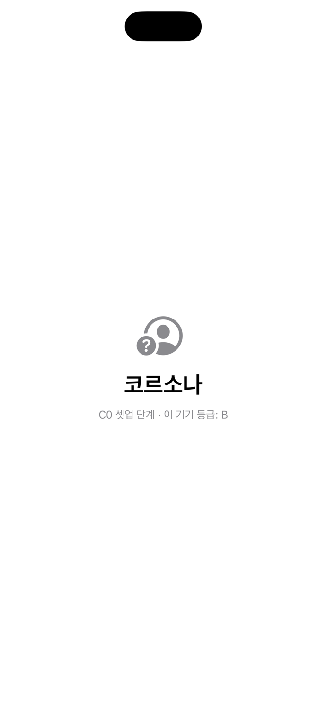 | 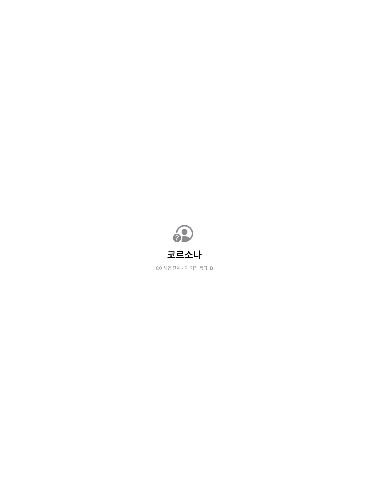 |

</details>

#### 🧪 실기기(2026-10-05) — iPhone 16·MacBook Air M4, 전면 카메라

시뮬레이터가 아니라 **실제 기기**에서 처음 돌려본 결과다. 처음엔 버그처럼 보였지만, 끝까지 추적해보니 **로직은 처음부터 맞았다** — 과정을 솔직하게 남긴다.

| MacBook Air M4 — B (기대대로) | iPhone 16 — 처음엔 B(?) | iPhone 16 — 진단 후 A(확정) |
|---|---|---|
| 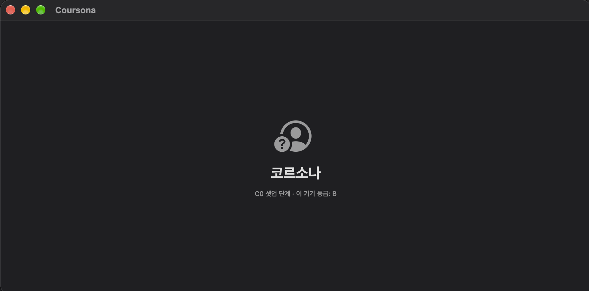 | 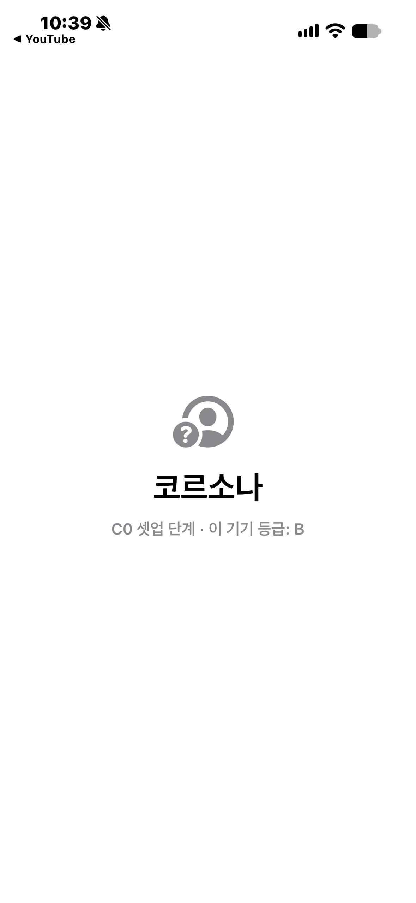 | 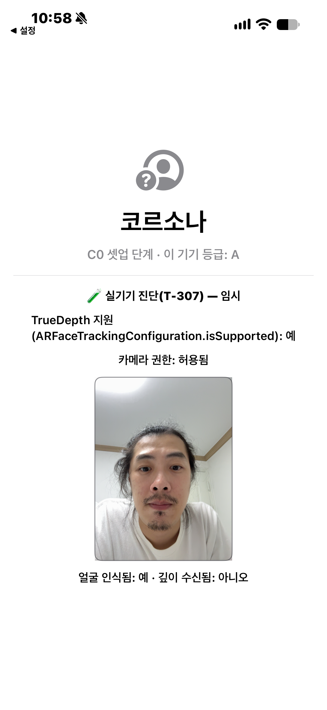 |

**추적 과정**:
1. iPhone 16(Face ID·TrueDepth 탑재, [Apple 공식 스펙](https://www.apple.com/iphone-16/specs/)으로 확인)이 A가 아니라 B로 두 번 나왔다.
2. 1차 가설 — 타이밍: 최초 실행 시 카메라 권한 팝업에 응답하는 시간이 `TierClassifier`의 2초 깊이-대기 윈도를 깎아먹을 수 있다고 보고, 권한이 `.notDetermined`면 먼저 묻고 기다리게 고쳤다. 하지만 권한을 이미 승인한 뒤 재실행해도 B가 나와서, **이게 근본 원인이 아님**이 드러났다.
3. 더 추측하지 않고 `ContentView`에 임시로 **라이브 미리보기 + 상태(TrueDepth 지원·권한·얼굴 인식·깊이 수신)를 전부 화면에 띄우는 진단 코드**를 넣었다. 결과: TrueDepth 지원 예·권한 허용됨·얼굴 인식 예·**최종 등급 A**. "깊이 수신 아니오"로 보인 건 버그가 아니라 TrueDepth 깊이 프레임이 컬러 프레임과 주기가 달라 매 프레임 오지 않는 정상 동작이, 화면이 멈춘 순간 우연히 그 프레임이었을 뿐이다.

**진짜 원인**: `ContentView`(C0 자리표시자)가 라이브 미리보기 없이 백그라운드에서 조용히 2초만 보고 끝나는 구조라, 그 2초 동안 사용자가 카메라를 보고 있지 않으면(안내가 전혀 없으니 당연히 그럴 수 있다) 얼굴이 안 잡혀 B로 떨어지는 **테스트 방법론 문제**였다 — `TierClassifier` 판정 로직 자체는 수정이 필요 없었다(권한 대기 개선만 유효하게 남겨둔다). 진단에 썼던 임시 UI는 확인 후 바로 되돌렸다.

**확정된 제품 요구사항**: C8에서 실제 캡처 진입 화면을 만들 때는 등급 판정 중 반드시 라이브 미리보기(또는 최소 "카메라를 봐주세요" 안내)를 같이 보여줘야 한다 — 안내 없이 조용히 판정하면 실사용자도 똑같이 헷갈린다.

#### 🧪 실기기(2026-10-06) — 위 결론을 따라 안내를 넣었는데도 또 B, 진짜 원인은 따로 있었다

위 "확정된 제품 요구사항"대로 `ContentView`에 "카메라를 봐주세요…" 안내를 넣었는데, 사용자가 다시 테스트해보니 **또 B**가 나왔다. 이번엔 Xcode가 연결된 실제 iPhone에 직접 빌드·설치·실행해서 콘솔 로그를 받아봤다(사람이 화면을 보고 설명해주는 대신 도구로 직접 확인) — 그 결과 **지난 결론이 틀렸다는 걸 알게 됐다**:

1. `TierClassifier`에 임시 진단 로그(경과 시간·`isTracked`·`hasDepth`)를 심고 실기기에서 직접 실행.
2. 로그를 보니 얼굴 추적(`isTracked`)은 **0.5초 안에 바로** 됐다 — "카메라를 안 보고 있었다"는 가설이 틀렸다는 뜻이다.
3. 그런데 `capturedDepthData`가 붙은 프레임 자체가 평균 **≈0.86초 간격**으로 드물게 왔다(20ms 간격 폴링 6초 동안 281번 중 7번만 깊이 있음). 두 차례 측정에서 첫 깊이 프레임이 각각 1.07초·3.64초 만에야 나타났다 — 옛 `depthTimeout = 2.0`초는 이 변동폭 안에서 자주 놓칠 만큼 짧았다.

**진짜 원인(정정)**: 사용자가 안 보고 있었던 게 아니라 **TrueDepth 깊이 프레임 자체가 2초 안에 안 올 수 있을 만큼 드물다** — 순전히 타이밍 임계값 문제였다. `TierClassifier.detectAutomaticTier`의 `depthTimeout`을 5.0초로 올리고 폴링 간격도 100ms→20ms로 좁혀(드문 프레임을 놓치지 않도록) 재배포 → **실기기에서 연속 2회 A로 정확히 판정**됨을 콘솔 로그로 직접 확인했다. 3플랫폼 + 실기기 빌드 전부 통과.

### Persona 룩 — 블렌더 에셋을 붙인 실제 렌더 (2026-10-08)

짧은 데모 영상(iPhone, 유튜브 쇼츠):

<a href="https://youtube.com/shorts/EZWZFZDAxVA?feature=share">
  
</a>

디자인 PRD(「Coursona 디자인 PRD — 비전프로 Persona 재현 에셋」)의 헤어·셔츠·눈알·입안 에셋을 **이 리포에서 Blender 5.2 헤드리스로 직접 만들어 내보내고**(`Docs/coursona_blender/`, 초상 `.blend` 사본에서 실행), `Default.coursonatemplate` 에 넣어 Mac 앱이 그린 것이다. 아래는 Mac 카메라(B 등급) 7컷으로 만든 코르소나를 검사 화면에서 그대로 캡처한 것 — 목업이 아니다. 머리색은 사진에서 잰 값(틴트 ÷ 0.63), 셔츠는 네이비 칼라 셔츠(단추·플래킷), 하단은 셰이더 페이드, 눈알·입안은 실제 메시다.

| 레퍼런스(Apple Persona) · 코르소나 정면 · ¾ |
|---|
| 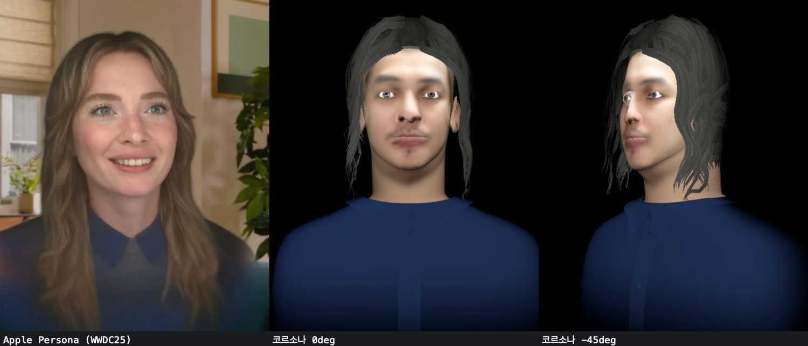 |

| 정면 · −45° · +45° (유령 룩: 프레넬 가장자리 + 하단 페이드) |
|---|
| 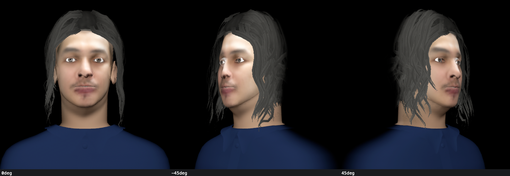 |

| 포즈 5종(무표정·미소·눈 감기·입 벌림·시선) | 눈 감기 — 눈알 깊이 보정 뒤 |
|---|---|
| 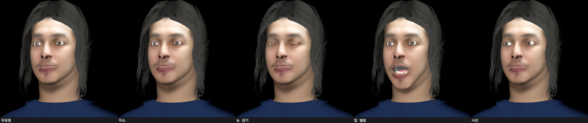 | 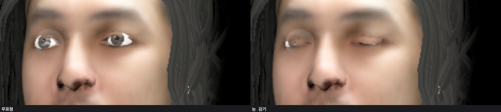 |

| −90° … +90° 5° 간격 37장 |
|---|
| 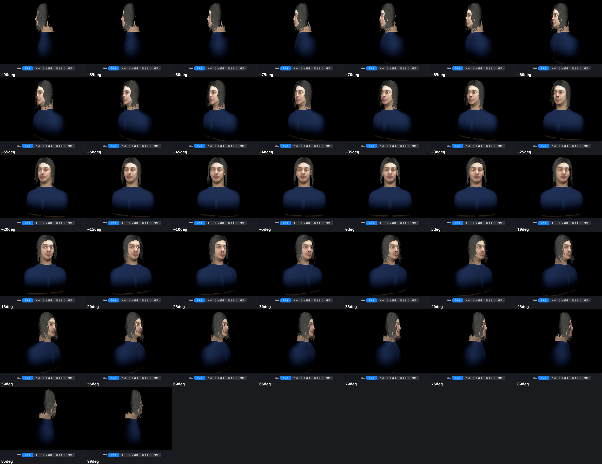 |

이 라운드에서 실측으로 잡은 것: 사진 폴백 피팅이 5점만 남아 머리가 0.5 m 날아가던 RBF 퇴화(앵커·λ 재풀이·45 mm clamp), 헤어 카드의 알파 영역이 깊이를 써 뒤의 반투명 흉상이 검게 뚫리던 문제(`discard_fragment`), 라이브러리 USDZ 가 비어 나오던 블렌더 뷰 레이어 제외, 스킨 메시가 아마추어 엔티티로 합쳐져 프림 아래 모델이 없는 RealityKit 동작, 눈을 감아도 눈알이 뚫고 보이던 것(사진 피팅의 눈 둘레 워프 vs 눈알 구면 — 눈을 감은 눈꺼풀 정점이 모두 구면 바깥에 오도록 눈알을 뒤로 밀어 해결). 남은 것과 수치는 `Docs/Tasks.md` D 절.

### 실기기(iPhone, TrueDepth A등급) 첫 촬영 — 어깨 스케일 겹침 실측

위까지는 전부 Mac(B등급, 사진 폴백)으로 만든 코르소나다. 사용자가 실제 iPhone 16 의 TrueDepth 카메라로 직접 A등급 코르소나를 만들어 찍은 화면이 아래다 — 등급 배지가 "A"로 뜨고, 겹침 의심·유령 룩·포즈 세그먼트 등 화면 자체는 Mac 과 동일하게 동작한다. 5° 간격이 아니라 사용자가 직접 회전 슬라이더를 0°·45°·90°·−45°·−90° 로 돌리며 찍었다.

| 0° · 45° · 90° · −45° · −90° (각 이미지 아래 각도 표시) |
|---|
| 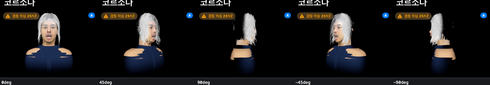 |

이 촬영이 바로 "두 가지 버전이 겹친 것 같다"는 사용자 보고의 실물이다. 자세히 보면 양쪽 어깨·칼라 경계가 피부색과 남색이 톱니 모양으로 번갈아 나온다 — 셔츠 메시의 가장자리와 TrueDepth 로 실측된 진짜 어깨 윤곽이 서로 다른 자리에서 만나는 것이다. 코드를 추적해 보니 원인은 명확했다: 눈알·입안은 피팅 결과의 실제 크기 비율(`identity.scale`)을 보정받지만, 헤어·셔츠는 그 보정이 통째로 빠져 있었다(`PersonaAssets.swift`). 사진 등급(B·C)은 단안 사진이라 `identity.scale` 이 항상 정확히 1로 고정되므로 이 버그가 지금까지의 모든 Mac 테스트에서 전혀 드러나지 않았다 — TrueDepth 로 실제 깊이를 재는 A등급만 1이 아닌 실제 비율을 내놓기 때문에, 이번이 이 버그가 눈에 보일 수 있는 첫 순간이었다. 처음엔 헤어·셔츠를 Head 조인트 위치를 축으로 `identity.scale` 만큼 균일하게 늘리는 보정을 넣었는데, 그것도 **틀린 변환**이었다 — 바로 아래에서 이어진다.

### 실기기 캡처 검수 — 네 가지 수정 (2026-10-08 밤, 시뮬레이터로 재현·검증)

iPhone 없이도 실기기 결과를 들여다볼 방법을 찾았다: iPhone 에서 AirDrop 으로 받은 `.coursona`(TrueDepth A 등급, 캡처 원본 동봉 14MB)를 **iOS 27 iPhone 16 시뮬레이터의 앱 컨테이너에 그대로 심어** 검수 화면으로 열고, 기기 상호작용 자동화로 포즈·토글·회전을 누르며 `simctl` 로 고해상도 스크린샷을 찍었다. 그렇게 보니 문제가 넷 있었고, 전부 추적했다.

| 왼쪽 수정 전 → 오른쪽 수정 후 (위: 무표정 · 아래: 시선) |
|---|
| 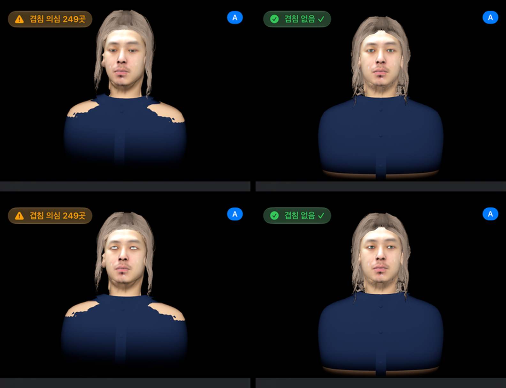 |

| 무표정 · 입 벌림 · 눈 감기 · 시선 · 유령 룩 끔 · −40° |
|---|
| 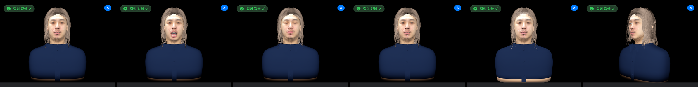 |

1. **어깨 삼각형 틈** — 이 캡처의 머리 스케일은 1.06 이다. 피터(`HeadPropagator`)는 어깨를 **x·z 만 원점 기준으로** 1.06 배 넓히고 y 는 그대로 두는데, 앱은 셔츠를 Head 조인트(y 0.36) 기준으로 **균일** 스케일했다. 그 차이로 셔츠의 어깨 경사선이 7 mm 내려갔고, 경사가 가파른 구간에서 흉상 어깨가 최대 15 mm 삐져나와 삼각형 구멍으로 보였다. 이제 `identity.scale` 을 믿지 않고 **흉상 정점에서 직접 읽는다** — 셔츠는 어깨 그룹의 레스트→피팅 축별 최소제곱 스케일(실측 ×(1.060, 1.000, 1.060)), 머리카락은 두피 그룹의 Procrustes 유사변환(실측 ×1.046, 이동 27 mm, RMS 2.3 mm). 피터가 무엇을 하든 에셋이 그 결과를 따라간다. 덤으로 머리카락이 정수리 위 15 mm·앞 12 mm 떠 있던 것(가발처럼 얹힌 느낌의 주원인)도 같이 사라졌다.
2. **"시선" 포즈에서 흰자만 보임** — 눈알 회전의 Y축 부호가 반대였다(`eyeLookOutLeft` 는 피사체 왼쪽인데 오른쪽으로 돌렸다). 부호를 고치니 홍채가 피사체 왼쪽(화면 오른쪽)으로 자연스럽게 움직인다.

   | 무표정(위) → 시선(아래) |
   |---|
   | 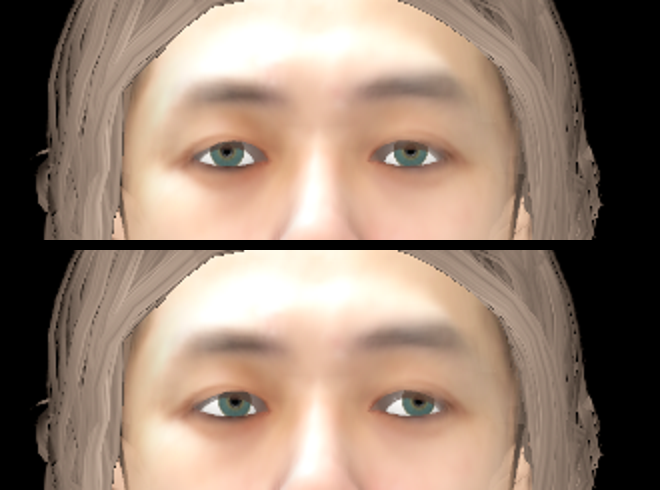 |

3. **"겹침 의심 249곳"이 포즈를 바꿔도 그대로** — 52개 표정을 각각 1.0 으로 뒀을 때 뒤집히는 캡 삼각형의 **합계**라 애초에 포즈와 무관했고, 템플릿 자체가 250 이었다. 게다가 눈·입 에셋이 붙으면 그 캡은 투명이라 보이지도 않는 걸 세고 있었다. 이제 배지는 **지금 포즈에서 실제로 보이는 캡**만 센다(렌더 정점·이 사람의 보정된 델타 기준). 모든 포즈에서 "겹침 없음 ✓"이고, 셰이프별 합계는 품질 카드 참고치로 내렸다.
4. **헤어라인이 가발처럼 딱 끊김** — 밀착(1번)과 두피 캡 테두리 2 cm 페이드, 머리카락 가장자리 알파 소프트닝, 캡 프레넬 제거까지 넣었지만 **절반만 해결**이다. 이 에셋은 두피 캡의 앞 테두리가 이마 표면보다 1~2 cm 안쪽에 묻혀 있어서, 눈에 보이는 헤어라인은 메시 테두리가 아니라 **두개골과의 교선**이다 — 그래서 여전히 직선으로 끊기고, 가르마 자리의 평평한 캡 판도 카드가 성겨서 남는다. 블렌더 쪽 과제로 넘긴다(캡 앞 테두리를 이마 위로 올리고 가르마 카드 밀도 보강).

이 과정에서 나온 **가장 중요한 발견**: 앱이 `MeshResource.Part.textureCoordinates1` 에 써서 다시 만든 uv1 이 **셰이더에 전혀 닿지 않고 있었다**. 셔츠의 presence 를 전부 0 으로 구워도 셔츠가 그대로 그려지는 실험으로 확인했다. 그동안 "턴테이블에선 presence 끔"·셔츠 하단 페이드 수치·헤어라인 페이드가 모두 조용히 무시되고 블렌더가 구운 uv1 이 쓰이고 있었고, 유령 룩을 꺼도 셔츠 아래가 투명해 "가슴이 맨살"로 보이던 진짜 이유도 이것(블렌더 presence 의 z 페이드)이었다. 에셋 메시를 `LowLevelMesh`(position·normal·uv0·uv1 시맨틱)로 다시 만드는 방식으로 바꿔 해결했다 — 이제 유령 룩을 끄면 셔츠가 네이비로 꽉 찬다(위 포즈 몽타주 다섯 번째). 전부 `swift test` 140/140, Mac·iPhone·시뮬레이터 빌드 통과.

#### 🧪 다음 실기기 세션 체크리스트 (iPhone 16 에 재설치 후)

- [ ] 갤러리에서 기존 A 등급 코르소나를 열어 **양 어깨에 피부색 틈이 없는지**, 회전 슬라이더 ±45°·±90° 에서도 그런지 — 위 몽타주와 같은 모습이어야 한다.
- [ ] 포즈 "시선"에서 홍채가 보이고 **화면 오른쪽**으로 움직이는지. "눈 감기"에서 눈알이 뚫고 나오지 않는지.
- [ ] 배지가 모든 포즈에서 "겹침 없음 ✓"인지(품질 카드를 펼치면 포즈별 0개, 합계 282개).
- [ ] 유령 룩을 끄면 셔츠가 아래까지 네이비인지(밑단 아래 2 cm 피부 띠는 에셋 밑단 높이라 아직 남는다 — 정상).
- [ ] **새로 한 번 더 촬영**해서 빌드가 끝까지 도는지, 콘솔에 `ARSession ... retaining ARFrames` 경고가 더 안 뜨는지(프레임 누수 수정 `c7de5f2` 의 첫 실기기 확인).
- [ ] 저장·보내기에서 AirDrop 으로 Mac 에 보내기 — 받는 Mac 의 다운로드 폴더에 **같은 이름의 파일이 있으면 미리 지울 것**(그게 "AirDrop이 실패함"의 실제 원인이었다).

## 예상 시나리오 — 등급별 한 걸음씩

아래 화면은 Google Stitch 로 만든 **UI 목업**이다. 실제로 동작하는 앱 화면이 아니라, 테크 PRD·UI 디자인 PRD 를 따라 "이렇게 보일 것"을 미리 그려 본 초안이다. 전체 화면 목록과 각 화면의 상태·문구는 `Docs/UXPRD.md` 에 있다.

### A 등급 — Face ID 카메라로 가장 정밀하게

| 1. 시작 | 2. 캡처(7컷 자동 촬영) | 3. 빌드 진행 |
|---|---|---|
| 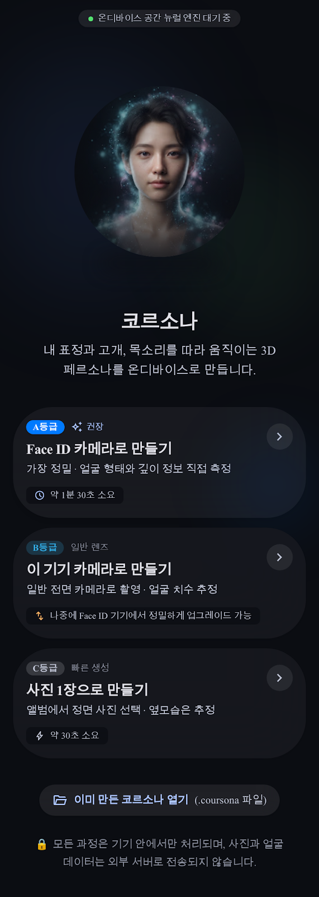 | 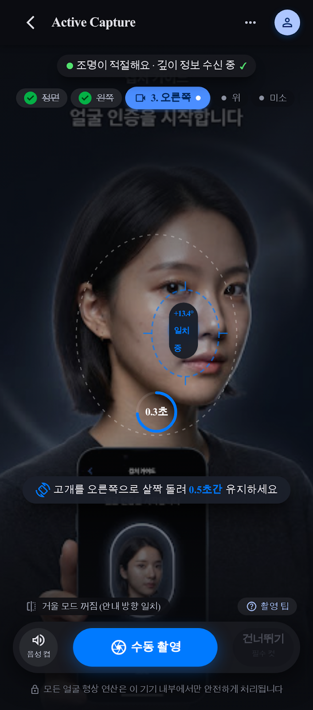 | 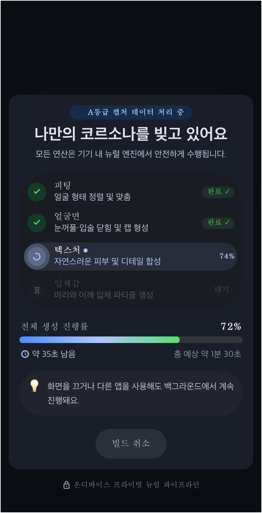 |
| 세 등급을 동등하게 제시하고, 이미 만든 코르소나를 열 수도 있다 | 각도 링 안에서 0.5초 유지하면 자동 촬영. 거울 모드는 기본 꺼짐 | 피팅 → 얼굴면 → 텍스처 → 입체감, 4단계. 화면을 꺼도 계속된다 |

| 4. 검수 | 5. 거울(라이브 구동) |
|---|---|
| 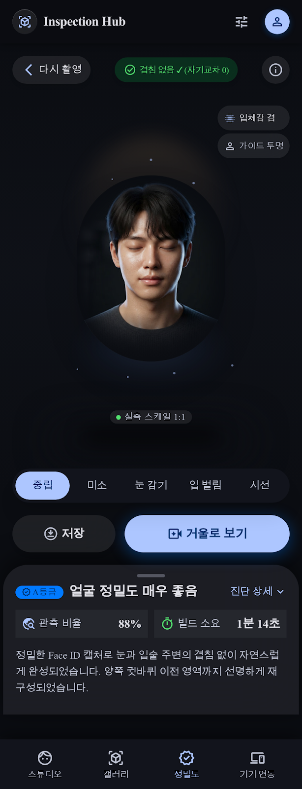 | 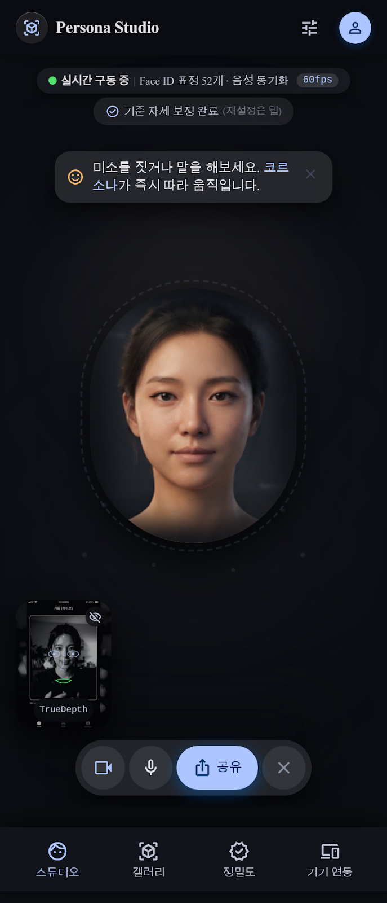 |
| "겹침 없음 ✓" 배지가 자기교차 0건일 때만 뜬다. 풀업 카드에 관측 비율·빌드 시간이 있다 | ARKit 표정 52개가 실시간으로 흉상을 움직인다 |

### B 등급 — 지금 쓰는 기기 카메라로 바로

| 캡처(Tier B) | 업그레이드 병합 |
|---|---|
| 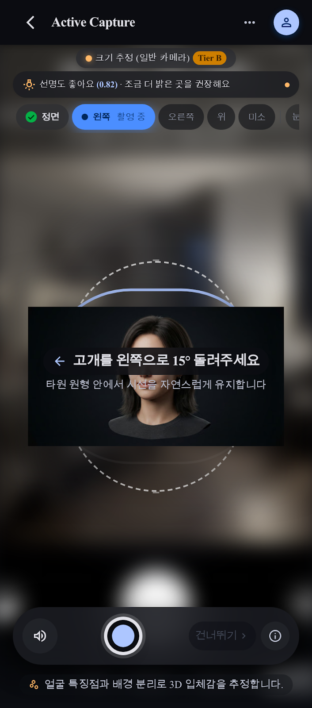 | 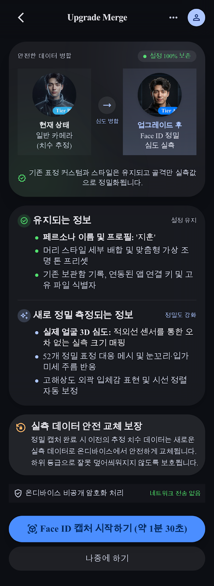 |
| 일반 카메라로 찍고 "크기 추정" 배지를 계속 보여 준다. 배경 분리로 윤곽만 안전하게 쓴다 | 나중에 Face ID 기기로 다시 찍으면 이름·머리 스타일은 그대로, 얼굴 형태만 정밀해진다 |

### C 등급 — 사진 1장으로 가장 빠르게

| 사진 적합성 체크 |
|---|
| 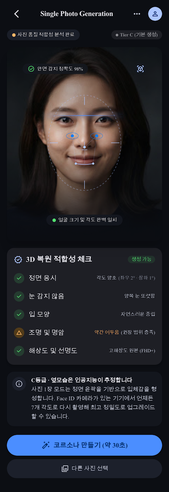 |
| 정면 응시·눈 감지 않음·조명 5항목을 보여 주고 "옆모습은 인공지능이 추정합니다"를 솔직하게 말한다 |

### 저장·보관·기기 간 전송 (세 등급 공통)

| 저장·내보내기 | 다른 기기로 보내기 | 라이브러리 |
|---|---|---|
| 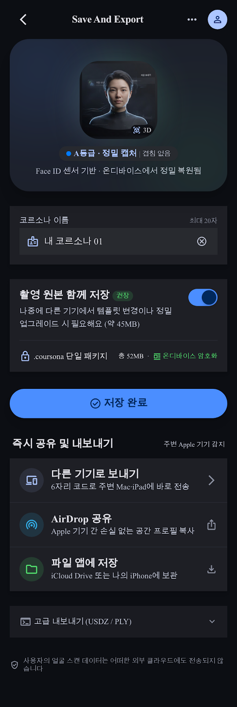 | 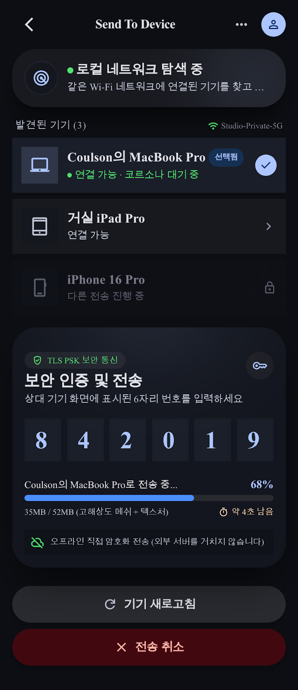 | 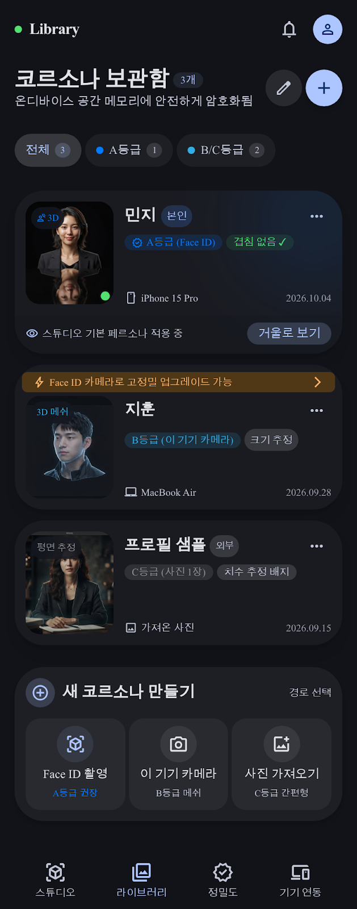 |
| 이름·원본 동봉 여부를 정하고 `.coursona` 하나로 묶는다 | 같은 Wi-Fi 안에서 6자리 코드로 iPhone·iPad·Mac 이 서로 주고받는다 | 등급 배지와 겹침 없음 표시로 만든 코르소나를 관리한다 |

### Mac — 캡처부터 거울까지 전부 가능

| 메인 작업공간 | 권한·시스템 상태 |
|---|---|
| 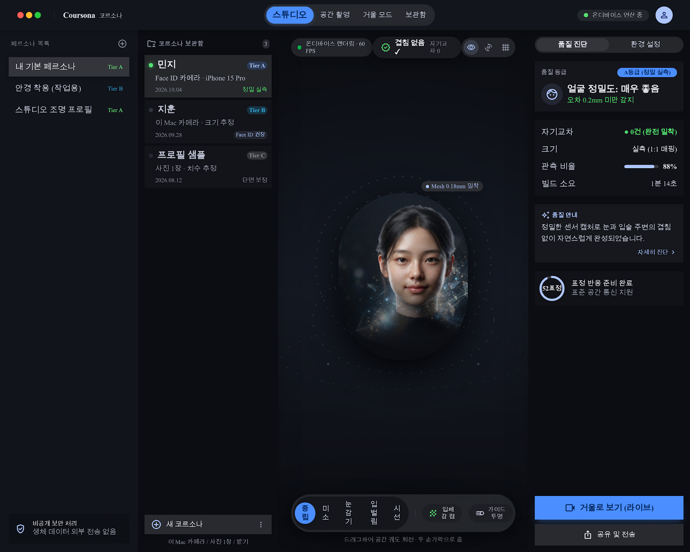 | 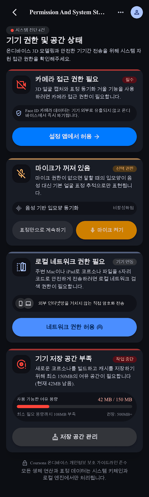 |
| 사이드바(보관함) · 가운데 뷰포트 · 오른쪽 인스펙터(품질 진단·환경 설정) 3단 구성 | 카메라·마이크·로컬 네트워크·저장 공간을 한 화면에서 확인한다 |

## 예상 결과물 — 완성됐을 때 무엇이 달라지는가

- **얼굴면이 완성된다.** 초상에서 눈꺼풀·입 주변이 튀어나오던 문제(분리된 눈알·치아 메시가 피팅된 얼굴과 어긋남)가 사라진다. 검수 화면의 "겹침 없음 ✓" 은 숫자(자기교차 0건)를 사람 말로 바꾼 것이다.
- **세 플랫폼이 같은 결과를 낸다.** iPhone 에서 만든 `.coursona` 를 Mac 에서 열어도, Mac 에서 만든 것을 iPad 로 보내도 같은 모습·같은 표정 반응이 나온다.
- **아무 기기도 막지 않는다.** TrueDepth 가 없는 Mac·구형 iPhone·iPad 도 B 등급으로 시작할 수 있고, 나중에 Face ID 기기에서 그대로 업그레이드된다.
- **모든 처리가 기기 안에서 끝난다.** 사진·얼굴 데이터는 서버로 가지 않는다. 모델이 필요한 곳(의사 깊이 추정, 외형 힌트)은 Apple 이 제공하는 온디바이스 모델만 쓴다.

## 아키텍처

초상의 `ChosangKit` 을 복사해 시작했다. `CoursonaFace`·`CoursonaML`·`CoursonaDrive`·`CoursonaStudio` 는 이 프로젝트에만 있는 신규 모듈이다(`CoursonaSplat` 은 있다가 폐기). 화살표는 전부 실제 코드의 의존 관계다.

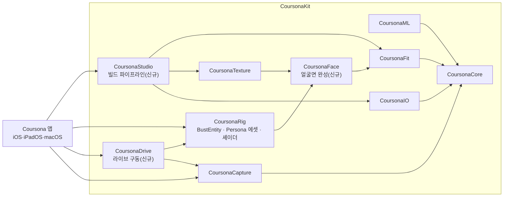
```mermaid
graph LR
    subgraph CoursonaKit["CoursonaKit"]
        Core["CoursonaCore"]
        Capture["CoursonaCapture"]
        ML["CoursonaML"]
        Fit["CoursonaFit"]
        Face["CoursonaFace<br/>얼굴면 완성(신규)"]
        Texture["CoursonaTexture"]
        Rig["CoursonaRig<br/>BustEntity · Persona 에셋 · 셰이더"]
        Drive["CoursonaDrive<br/>라이브 구동(신규)"]
        IO["CoursonaIO"]
        Studio["CoursonaStudio<br/>빌드 파이프라인(신규)"]
    end
    App["Coursona 앱<br/>iOS·iPadOS·macOS"]

    Capture --> Core
    ML --> Core
    Fit --> Core
    Face --> Fit
    Texture --> Face
    Rig --> Face
    Drive --> Rig
    Drive --> Capture
    IO --> Core
    Studio --> Fit
    Studio --> Texture
    Studio --> IO
    App --> Studio
    App --> Rig
    App --> Drive
    App --> Capture
```

## 지금 리포에 있는 것

```
Docs/
  TechPRD.md           테크 PRD v0.2 — 등급 A/B/C, 얼굴면 완성 파이프라인(F1–F10), 단안 피팅(M1–M6), 패키지 포맷
  Tasks.md              C0–C8 + D 절(Persona 재현 에셋), 태스크 T-001~T-810 · D-101~D-508 (진행 상황·실측 메모)
  AssetContract.md      블렌더 ↔ 앱 에셋 계약(coursona_assets.json 스키마, presence 식, 프림 이름, 역할별 머티리얼)
  Coursona 디자인 PRD — … .md   Persona 재현 에셋 디자인 PRD(투명한 틀 원칙, 유령 룩)
  coursona_blender/     Blender 5.2 헤드리스 스크립트 — 헤어·셔츠·눈알·입안 생성·검사·내보내기(초상 .blend 사본에서 실행)
  UXPRD.md               UI/UX 디자인 PRD — Stitch 목업 채택/배제 판정, 화면별 상태·문구
  UIUX-Prompt.md · Stitch-Request.md   UI 디자인 AI 용 요청문 · Google Stitch 운용 프롬프트
  stitch_new_project_starter/, … 2/    Stitch 목업(14화면, 이 README 의 "예상 시나리오")
  screenshots/          이 README 의 실제 렌더·실기기 캡처(c0-/c3-/c8-/d4-/d5-)
CoursonaKit/             로컬 Swift 패키지 — 실제로 빌드·테스트되는 코드
  Sources/CoursonaCore           모델·포맷·ARKit 52 타입·수학(Procrustes·RBF·TPS), AssetManifest(coursona_assets.json), FaceSurfacePartition
  Sources/CoursonaCapture        ARFaceTracking(A)·AVCapture+Vision(B) 캡처, TierClassifier, 선택 2컷 게이팅, PhotoSuitability(C 등급), DepthCoverage·PersonCoverage(저장 전 검증)
  Sources/CoursonaML             온디바이스 모델 래퍼(자리)
  Sources/CoursonaFit            피팅 — FacePatchSolver·HeadPropagator(밀집, A)·SparseFitter(단안, B·C)·SilhouetteFitter·UserShapeDeltas(F7)
  Sources/CoursonaFace           얼굴면 완성 — CapBuilder(눈·입 구멍 닫기)·SelfIntersectionCheck
  Sources/CoursonaTexture        투영·접합·탈조명·채움(Metal + CPU), 캡까지 같은 파이프라인으로 투영, 머리색 추정
  Sources/CoursonaRig            BustEntity(LowLevelMesh, 52 셰이프 블렌딩, 캡 머티리얼, 유령 룩, 포즈별 겹침 검사)·PersonaAssets(헤어·셔츠·눈알·입안 부착, 레스트→피팅 변환, uv1 굽기)·PersonaSurfaceShader·FaceRig·ClipPlayer
  Sources/CoursonaDrive          라이브 구동 — ARKitFaceDriver(iOS)·VisionFaceDriver(Mac 기본)·MicVisemeDriver·FaceDriverCoordinator(우선순위 합성) 구현됨, 실추적은 미검증
  Sources/CoursonaIO             .coursona 패키지(UTI 선언 포함)·캡처 번들·템플릿 캐시·zip·Bonjour 전송(화면 미연결)
  Sources/CoursonaStudio         PersonaBuildPipeline — 캡처 번들→피팅→텍스처→패키지 저장 오케스트레이션, PersonMatte
  Sources/CoursonaValidate · coursona-validate   템플릿·에셋 계약 검사 라이브러리 + CLI(--fit·--texture·--synthetic·--with-usdz)
  Tests/CoursonaKitTests         140개 테스트, 31개 스위트
coursona/                Xcode 앱 타깃 — 등급 선택→캡처→빌드→검수→저장·AirDrop, 갤러리까지 동작
  App/AppModel.swift · RootView.swift · DesignSystem/Theme.swift   앱 상태·탭 셸·색상 토큰/배지
  Views/StartTierView.swift   화면 1 — 등급 3가지 카드 + 추천 배지
  Views/CaptureGuideView.swift 화면 2(A/B 공용) · Views/PhotoSuitabilityView.swift 화면 3(C 등급)
  Views/BuildProgressView.swift 화면 4 — 4단계 체크리스트
  Views/InspectionView.swift  화면 5 — RealityView 뷰포트, 포즈 세그먼트, 회전 슬라이더, 유령 룩 토글, 포즈별 겹침 배지, 품질 카드, Persona 에셋 부착
  Views/SaveShareView.swift   화면 6b — 이름 바꾸기, 자동 내보내기 + ShareLink(AirDrop)
  Views/GalleryView.swift     화면 8 — 저장된 .coursona 목록, 열기·다시 만들기
  Views/PermissionsView.swift 화면 9 · Views/ComingSoonView.swift  거울·전송 자리표시자
  Shaders/PersonaSurface.metal   Persona 에셋(presence·프레넬·하단 페이드·알파 소프트닝)과 흉상 유령 룩 표면 셰이더
  Info.plist               .coursona UTI(com.coulson.coursona.persona) 선언, Bonjour 서비스
  Resources/Templates/Default.coursonatemplate   초상 흉상 템플릿 + Persona 에셋(Template.usdz·library·textures·coursona_assets.json), 44MB
coursona.xcodeproj/
tools/make_default_template.sh   블렌더 산출 Template 폴더 → Default.coursonatemplate 패킹
```

## 빌드·테스트해 보기

```bash
cd CoursonaKit
swift build        # 11개 모듈 + CLI 빌드
swift test          # 140개 테스트 — 피팅(밀집+단안)·텍스처(합성 번들)·빌드 파이프라인 왕복·전송·얼굴면 분리·자기교차 검사·선택 컷 직접 치환(F7)·사진 적합성·깊이 검증·인물 매트 샘플링·방향 기록·캡 UV 섬·1€ 필터·Vision 얼굴 신호·에셋 매니페스트까지 전부 로컬에서 돈다(약 4분)
```

앱(`coursona` 스킴)은 Xcode 에서 열어 macOS·실제 iPhone·iPhone 시뮬레이터로 빌드된다. 등급 선택→캡처→빌드→검수→저장·AirDrop→갤러리까지 동작하고, 거울(라이브 구동)·기기 간 전송·접근성은 이어서 만드는 중이다. Persona 에셋을 다시 만들려면 `Docs/coursona_blender/`(Blender 5.2) → `tools/make_default_template.sh`.

## 로드맵

| 마일스톤 | 내용 | 상태 |
|---|---|---|
| C0 | 프로젝트 셋업, `CoursonaKit` 포팅 | ✅ |
| C1 | 한 메시·투명 흉상(분리 엔티티 폐기) | ✅ |
| C2 | 얼굴면 완성(A 등급) | ✅ |
| C3 | 캡처 A/B/C | 🔄 — 선택 2컷 게이팅·F7·C 등급 사진 적합성 검사·저장 전 깊이 검증·B 등급 캡처 품질·인물 매트 게이트·iPad 가로 거치 기록 완료, 카메라 보정 데이터(의도적 보류)·Vision 조밀 대응·단안 깊이 모델·전체 인물 매트(OS 27+)·🧪 실기기 체크리스트는 남음 |
| C4 | 단안 피팅(B·C 등급) | ✅ (코드·테스트는 C0 포팅분이 이미 만족, 🧪 실기기 빌드만 남음) |
| C5 | 텍스처·입체감 | 🔄 — 캡 전용 UV 섬·눈입 캡 투영(T-502) 완료. 스플랫(T-503~504b)은 **폐기**, 입체감 v3(한 메시·한 텍스처 + 유령 룩) + Persona 재현 에셋(D 절: 헤어·셔츠·눈알·입안, 블렌더 헤드리스 생성, 레스트→피팅 배치, uv1 LowLevelMesh 굽기)으로 대체. 남은 것: 헤어라인·가르마 캡(블렌더 과제), 실기기 성능(T-505) |
| C6 | 라이브 구동(거울) | 🔄 — 드라이버 3종 + 우선순위 합성(T-601~603)·`FaceRigSystem` 합성 규칙·시선(눈알 회전, 부호 수정 완료) 구현, 거울 화면(T-808)·실기기 실추적·성능 실측(T-605)은 남음 |
| C7 | 패키지·업그레이드 병합·플랫폼 동일성 | 🔄 — `.coursona` UTI 선언·AirDrop 내보내기 실기기 확인(iPhone→Mac), 병합·6자리 코드 전송은 남음 |
| C8 | 검수·마감 + 화면 UI(UXPRD 9개 화면) | 🔄 — UI 1~3단계(T-805~807)·갤러리·실기기 버그 수정(T-807b, D-508) 완료, 거울·전송·접근성(T-808~810)은 이어서 진행 중 |

세부 작업 단위는 `Docs/Tasks.md` 참고.

## 참고

- 초상(Chosang) — 블렌더 흉상 + TrueDepth 피팅의 원형. 코르소나는 그 코드를 복사해 시작하고, 초상 리포는 수정하지 않는다.
- 소반(Soban) — 두레반 모임 앱. 참고만.

## 라이선스

미정.
