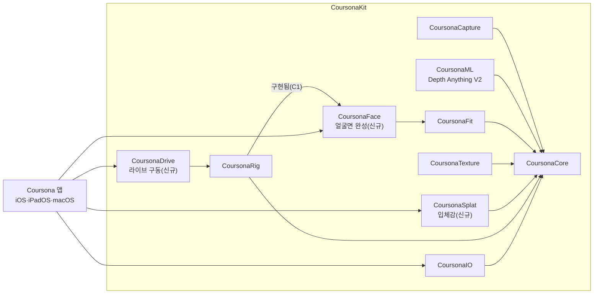

# 코르소나 (Coursona)

**콜슨이 만든 페르소나** — iPhone·iPad·Mac 에서 내 촬영본으로 만드는 3D 흉상 페르소나. Vision Pro 의 페르소나처럼 내 표정·고개·목소리를 따라 움직이지만, 온디바이스로만 동작하고 세 플랫폼 전부에서 쓸 수 있다.

> 상태: **구현 중 — C0·C1 완료**. `CoursonaKit` 패키지가 실제로 빌드되고 테스트가 돈다(Swift Testing **86개 전부 통과**). 눈·입을 분리 물체 없이 같은 메시 안에서 닫는 얼굴면 분리까지 끝났다. 화면 UI 는 아직 자리표시자이고, 피팅·텍스처·전송은 다음 단계(C2~)다. 상세 현황은 `Docs/Tasks.md`.

## 한 줄 요약

블렌더에서 만든 흉상 메시가 기하의 진실이다. 사용자는 **등급 3가지** 중 하나로 그 흉상을 "내 얼굴"로 만든다.

| 등급 | 입력 | 기기 | 정밀도 |
|---|---|---|---|
| **A** | Face ID 카메라(TrueDepth) | iPhone·iPad(Face ID 모델) | 얼굴 형태·깊이 직접 측정 |
| **B** | 일반 전면 카메라 | Mac 전부, Face ID 없는 iPhone·iPad | 얼굴 치수는 추정, 나중에 A 로 업그레이드 가능 |
| **C** | 사진 1장 | 전부 | 정면만 측정, 옆모습은 추정, 가장 빠름 |

초상(Chosang) 프로젝트에서 검증한 "블렌더 흉상 + ARKit 패치 치환" 피팅은 그대로 가져오되, **눈알·입안을 따로 띄워 생기던 돌출·어긋남을 없앤다** — 분리된 물체 대신 같은 메시 안에서 눈·입 구멍을 자연스럽게 닫는다. 얼굴면만 또렷하게 보이고 나머지(머리·목·어깨)는 입체감만 있는 투명한 흉상으로 완성한다.

## 지금까지 구현된 것 (C0·C1)

문서가 아니라 실제로 빌드·테스트되는 코드 기준이다.

- **`CoursonaKit` 로컬 패키지** — 초상(Chosang)의 `ChosangKit` 을 복사해 11개 모듈로 포팅(Core·Capture·ML·Fit·Face·Texture·Splat·Rig·Drive·IO·Validate). 식별자·파일 확장자·UTI 를 전부 Coursona 로 바꿨다. `CoursonaFace`·`CoursonaSplat`·`CoursonaML`·`CoursonaDrive` 는 이 프로젝트에만 있는 신규 모듈이다.
- **등급 자동 판정** — `TierClassifier`: Face ID 카메라가 있고 2초 안에 깊이가 들어오면 A, 아니면 B. 아무 기기도 막지 않는다.
- **얼굴면 분리 + 눈·입 구멍 닫기** — `FaceSurfacePartitioner`(얼굴면 삼각형만 앞쪽으로 재배열) + `CapBuilder`(경계 변 위상 탐색으로 눈·입의 실제 열린 테두리를 찾아 중간 고리+중심으로 닫는다). 블렌더 내부 상수를 추측하지 않는, 처음 설계보다 더 안전한 방식으로 교체했다 — `Docs/TechPRD.md` §6.2 구현 노트.
- **`BustEntity` 2파트 렌더링** — 얼굴면/나머지를 별도 `LowLevelMesh.Part` + 머티리얼로 분리, 나머지는 기본 완전 투명, 디버그용 고스트 토글(`setGhostVisible`) 포함.
- **템플릿 반입** — 초상의 기본 템플릿에서 분리 눈알·입안 파일(`EyesMouth.usdz`)만 제외하고 `Default.coursonatemplate` 로 재구성.
- **검증**: `cd CoursonaKit && swift test` → **86개 테스트, 19개 스위트 전부 통과**(기존 피팅·텍스처 로직 포함, 새 얼굴면 테스트 4개 포함). Xcode 빌드 3종(macOS·iPhone 시뮬레이터·iPad 시뮬레이터) 전부 성공.

## 예상 시나리오 — 등급별 한 걸음씩

아래 화면은 Google Stitch 로 만든 **UI 목업**이다. 실제로 동작하는 앱 화면이 아니라, 테크 PRD·UI 디자인 PRD 를 따라 "이렇게 보일 것"을 미리 그려 본 초안이다. 전체 화면 목록과 각 화면의 상태·문구는 `Docs/UXPRD.md` 에 있다.

### A 등급 — Face ID 카메라로 가장 정밀하게

| 1. 시작 | 2. 캡처(7컷 자동 촬영) | 3. 빌드 진행 |
|---|---|---|
|  |  |  |
| 세 등급을 동등하게 제시하고, 이미 만든 코르소나를 열 수도 있다 | 각도 링 안에서 0.5초 유지하면 자동 촬영. 거울 모드는 기본 꺼짐 | 피팅 → 얼굴면 → 텍스처 → 입체감, 4단계. 화면을 꺼도 계속된다 |

| 4. 검수 | 5. 거울(라이브 구동) |
|---|---|
|  |  |
| "겹침 없음 ✓" 배지가 자기교차 0건일 때만 뜬다. 풀업 카드에 관측 비율·빌드 시간이 있다 | ARKit 표정 52개가 실시간으로 흉상을 움직인다 |

### B 등급 — 지금 쓰는 기기 카메라로 바로

| 캡처(Tier B) | 업그레이드 병합 |
|---|---|
|  |  |
| 일반 카메라로 찍고 "크기 추정" 배지를 계속 보여 준다. 배경 분리로 윤곽만 안전하게 쓴다 | 나중에 Face ID 기기로 다시 찍으면 이름·머리 스타일은 그대로, 얼굴 형태만 정밀해진다 |

### C 등급 — 사진 1장으로 가장 빠르게

| 사진 적합성 체크 |
|---|
|  |
| 정면 응시·눈 감지 않음·조명 5항목을 보여 주고 "옆모습은 인공지능이 추정합니다"를 솔직하게 말한다 |

### 저장·보관·기기 간 전송 (세 등급 공통)

| 저장·내보내기 | 다른 기기로 보내기 | 라이브러리 |
|---|---|---|
|  |  |  |
| 이름·원본 동봉 여부를 정하고 `.coursona` 하나로 묶는다 | 같은 Wi-Fi 안에서 6자리 코드로 iPhone·iPad·Mac 이 서로 주고받는다 | 등급 배지와 겹침 없음 표시로 만든 코르소나를 관리한다 |

### Mac — 캡처부터 거울까지 전부 가능

| 메인 작업공간 | 권한·시스템 상태 |
|---|---|
|  |  |
| 사이드바(보관함) · 가운데 뷰포트 · 오른쪽 인스펙터(품질 진단·환경 설정) 3단 구성 | 카메라·마이크·로컬 네트워크·저장 공간을 한 화면에서 확인한다 |

## 예상 결과물 — 완성됐을 때 무엇이 달라지는가

- **얼굴면이 완성된다.** 초상에서 눈꺼풀·입 주변이 튀어나오던 문제(분리된 눈알·치아 메시가 피팅된 얼굴과 어긋남)가 사라진다. 검수 화면의 "겹침 없음 ✓" 은 숫자(자기교차 0건)를 사람 말로 바꾼 것이다.
- **세 플랫폼이 같은 결과를 낸다.** iPhone 에서 만든 `.coursona` 를 Mac 에서 열어도, Mac 에서 만든 것을 iPad 로 보내도 같은 모습·같은 표정 반응이 나온다.
- **아무 기기도 막지 않는다.** TrueDepth 가 없는 Mac·구형 iPhone·iPad 도 B 등급으로 시작할 수 있고, 나중에 Face ID 기기에서 그대로 업그레이드된다.
- **모든 처리가 기기 안에서 끝난다.** 사진·얼굴 데이터는 서버로 가지 않는다. 모델이 필요한 곳(의사 깊이 추정, 외형 힌트)은 Apple 이 제공하는 온디바이스 모델만 쓴다.

## 아키텍처

초상의 `ChosangKit` 을 복사해 시작했다. `CoursonaFace`·`CoursonaSplat`·`CoursonaML`·`CoursonaDrive` 는 이 프로젝트에만 있는 신규 모듈이다. "구현됨(C1)" 표시가 붙은 연결은 이미 코드로 존재한다(`CoursonaRig → CoursonaFace`). 나머지는 설계대로 연결될 자리다.



## 지금 리포에 있는 것

```
Docs/
  TechPRD.md           테크 PRD v0.2 — 등급 A/B/C, 얼굴면 완성 파이프라인(F1–F10), 단안 피팅(M1–M6), 스플랫, 패키지 포맷
  Tasks.md              C0–C8 + 스파이크 S-1, 태스크 T-001~T-804 (C0·C1 완료 표시)
  UIUX-Prompt.md         UI 디자인 AI 용 요청문
  UXPRD.md               UI/UX 디자인 PRD — Stitch 목업 채택/배제 판정, 화면별 상태·문구
  Stitch-Request.md      Google Stitch 운용 프롬프트
  stitch_new_project_starter/      Stitch 목업 1차본(14화면, 이 README 에 쓴 것들)
  stitch_new_project_starter 2/    Stitch 목업 2차본(대안 테마 + 일부 폐기분)
CoursonaKit/             로컬 Swift 패키지 — 실제로 빌드·테스트되는 코드
  Sources/CoursonaCore           모델·포맷·ARKit 52 타입·수학(+ FaceSurfacePartition, Geometry.boundaryLoops)
  Sources/CoursonaCapture        ARFaceTracking(A)·AVCapture+Vision(B) 캡처, TierClassifier
  Sources/CoursonaML             온디바이스 모델 래퍼(C3 에서 채움)
  Sources/CoursonaFit            피팅(Procrustes·패치 치환·RBF·실루엣)
  Sources/CoursonaFace           얼굴면 완성 — CapBuilder(C1 구현됨), 나머지는 C2
  Sources/CoursonaTexture        투영·접합·탈조명·채움(Metal + CPU)
  Sources/CoursonaSplat          입체감(스플랫, C5 에서 채움)
  Sources/CoursonaRig            BustEntity(LowLevelMesh, 2파트 렌더)·FaceRig·ClipPlayer
  Sources/CoursonaDrive          라이브 구동(C6 에서 채움)
  Sources/CoursonaIO             패키지·전송·zip
  Sources/CoursonaValidate       템플릿 계약 검사
  Tests/CoursonaKitTests         86개 테스트(FaceSurfaceTests 포함)
coursona/                Xcode 앱 타깃 — CoursonaKit 연결됨, 화면 UI 는 아직 자리표시자
  Resources/Templates/Default.coursonatemplate   초상 템플릿에서 EyesMouth.usdz 제외하고 재구성(30MB)
coursona.xcodeproj/
tools/make_default_template.sh   템플릿 재압축 스크립트(EyesMouth 제외 고정)
```

## 빌드·테스트해 보기

```bash
cd CoursonaKit
swift build        # 11개 모듈 + CLI 빌드
swift test          # 86개 테스트 — 피팅·텍스처(합성 번들)·전송·얼굴면 분리까지 전부 로컬에서 돈다
```

앱(`coursona` 스킴)은 Xcode 에서 열어 macOS·iPhone 시뮬레이터·iPad 시뮬레이터로 빌드된다. 화면은 아직 자리표시자(현재 기기 등급만 표시)다.

## 로드맵

| 마일스톤 | 내용 | 상태 |
|---|---|---|
| C0 | 프로젝트 셋업, `CoursonaKit` 포팅 | ✅ |
| C1 | 한 메시·투명 흉상(분리 엔티티 폐기) | ✅ |
| C2 | 얼굴면 완성(A 등급) | ⏳ |
| C3 | 캡처 A/B/C | ⏳ |
| C4 | 단안 피팅(B·C 등급) | ⏳ |
| C5 | 텍스처·입체감(스플랫) | ⏳ |
| C6 | 라이브 구동(거울) | ⏳ |
| C7 | 패키지·업그레이드 병합·플랫폼 동일성 | ⏳ |
| C8 | 검수·마감 | ⏳ |

세부 작업 단위는 `Docs/Tasks.md` 참고.

## 참고

- 초상(Chosang) — 블렌더 흉상 + TrueDepth 피팅의 원형. 코르소나는 그 코드를 복사해 시작하고, 초상 리포는 수정하지 않는다.
- 소반(Soban) — 두레반 모임 앱. 참고만.

## 라이선스

미정.
